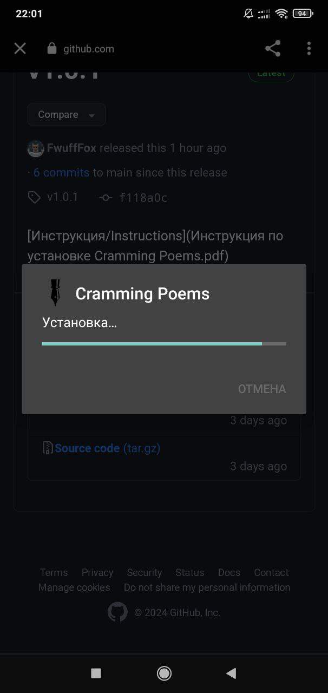

# Добро пожаловать в Cramming Poems

## Инструкция по установке Cramming Poems

### Нажимайте на то, что обведено ${\color{red}красным}$.

1. Переходим по ссылке на [последнюю версию приложения](https://github.com/2romanio005/cramming_poems/releases/latest):

	<https://github.com/2romanio005/cramming_poems/releases/latest>
	
	Вы увидите:
	
	

1. Начните ***скачку*** установочного файла

	

1. ***Дождаться*** скачивания

	

1. Открыть ***установочный файл***

	

1. Нажимаем ***“Установить”***

	

	1. Если высветится требование ***"разрешить установку из неизвестных источников"*** - разрешаем. [Инструкция](https://mi-check.ru/ustanovka-iz-neizvestnyx-istochnikov-v-miui-12/) есть по ссылке, но вроде тут всё очевидно:

		<https://mi-check.ru/ustanovka-iz-neizvestnyx-istochnikov-v-miui-12/>

	1. В конце должно выглядеть так
			
		
		
	1. После изменения настроек - снова открываем ***установочный файл***

1. Начинается установка - ***ничего*** не нажимаем

	

1. Google Play Защита пытается нас остановить – нажимаем ***“подробнее”***

	

1. Для продолжения установки нажимам ***“Всё равно установить”***

	

1. Если появляется такое окно (появляется не всегда) нажимаем ***“Не проверять”***

	

1. Приложение провериться, и после этого установка должна быть завершена, вы можете ***“открыть”*** приложение

	

1. На рабочем столе появится ***иконка*** нашего приложения 

	
	
1. Удалите установочный файл, он больше не нужен (всё будет работать и без этого пункта)

	
	
